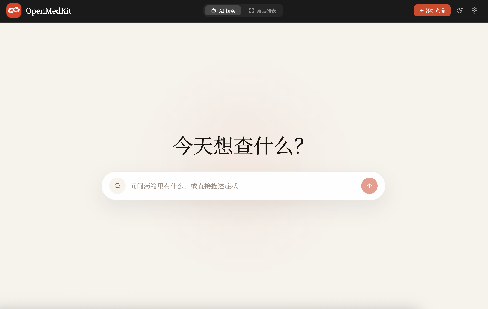
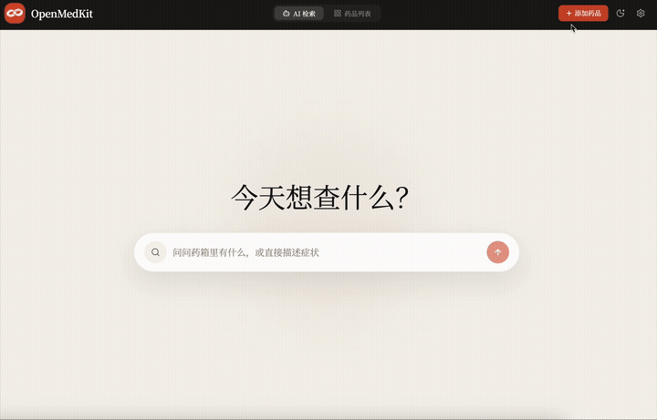
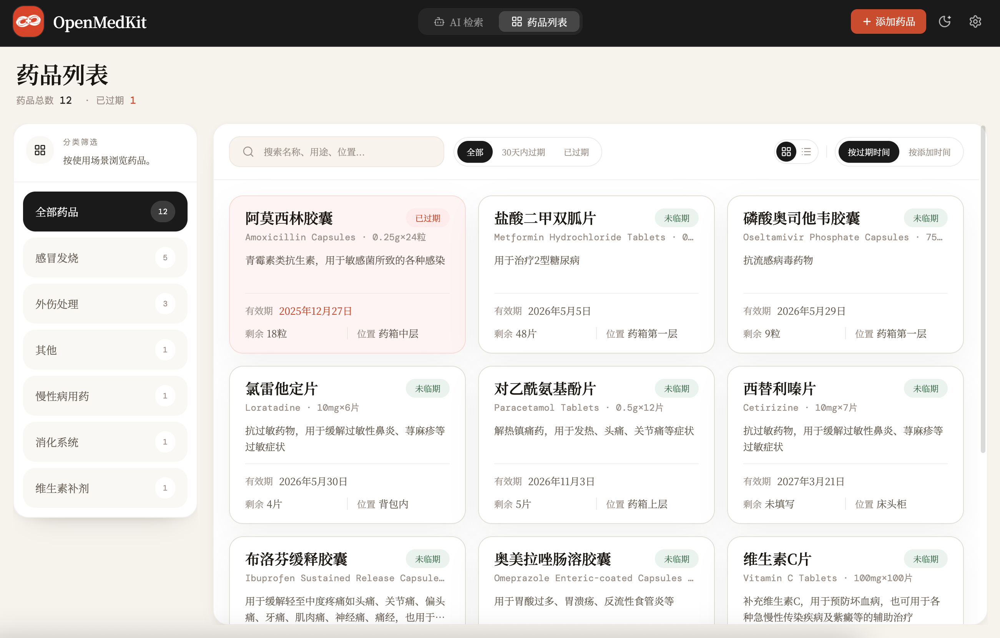

<div align="center">

# Open MedKit

**对着药箱说句话，剩下的交给 AI。**

家庭药箱管理工具 — 自然语言录入 · AI 结构化解析 · 过期自动提醒 · MCP Agent 接入

[](./LICENSE)
[](./DEPLOY.md)
[](./MCP.md)
[]()

</div>

---

<div align="center">



</div>

### Why Open MedKit

家里的药总是找不到、忘了过期、想不起来有没有。

Open MedKit 让你用**一句话**把药品录入药箱，用**一句话**从药箱里找药。没有复杂的表单，没有手动归类 —— AI 搞定一切，你只管说。

不想打开浏览器？Open MedKit 同时提供 [MCP Server](./MCP.md)，可以直接在 **Claude Code**、**Cursor**、**Claude Desktop**、**OpenClaw** 等 AI 客户端中通过自然语言管理药箱 —— 在终端里说一句「帮我加个布洛芬」，药品就入库了。

### Highlights

| | |
|:---|:---|
| **说一句话就入库** | 自然语言描述药品 → AI 提取名称、规格、有效期等全部字段，确认即入库 |
| **换行分隔批量录** | 多条药品换行粘贴，一键批量解析，适合首次整理一整箱药 |
| **问一句话就找药** | 「有退烧药吗」「快过期的有哪些」—— 像聊天一样检索药箱 |
| **过期自动提醒** | 到期 / 即将到期药品自动标记高亮，支持 Telegram / Discord / 飞书每日推送 |
| **Agent 原生接入** | 内置 [MCP Server](./MCP.md)，Claude Code / Cursor / Claude Desktop / OpenClaw 直接调用 tool 管理药箱 |
| **一行命令自部署** | `docker compose up -d`，药箱数据默认保存在本地 SQLite；启用 AI 或通知时仅与对应服务通信 |
| **兼容任意 AI** | OpenAI、Deepseek、Ollama…… 任何兼容 `/v1/chat/completions` 的 API 均可 |

### See it in action

<details>
<summary><b>AI 智能录入演示</b> — 说一句话，自动解析入库</summary>
<br>
<div align="center">



</div>
</details>

<details open>
<summary><b>药品列表</b> — 分类筛选 · 过期状态一目了然</summary>
<br>
<div align="center">



</div>
</details>

## Tech Stack

| Layer | Tech |
|---|---|
| Frontend | React 18 · TypeScript · Vite · TailwindCSS v3 |
| Backend | Hono (Node adapter) · TypeScript |
| Database | SQLite via better-sqlite3 |
| AI | Any OpenAI-compatible API (`/v1/chat/completions`) |
| Deploy | Single Docker container |

## Quick Start

### Docker (recommended)

```bash
git clone https://github.com/MonoYan/open-medkit.git
cd open-medkit
cp .env.example .env
# Edit .env — set your AI_API_KEY at minimum
docker compose up -d
```

Open http://localhost:3000.

首次打开 Web UI 时，应用会自动检测当前浏览器时区并写入服务端；后续的过期判断、AI 问答中的“今天”以及每日提醒时间都会以这个业务时区为准。

### Local Development

Prerequisites: Node.js >= 20

```bash
git clone https://github.com/MonoYan/open-medkit.git
cd open-medkit
npm install
cp .env.example .env
npm run dev
```

Frontend runs on http://localhost:5173, backend on http://localhost:3000.

如果你只通过 MCP / CLI / OpenClaw 使用 Open MedKit、从不打开 Web UI，请先初始化时区。未初始化时系统会回退到 `UTC`，不会使用服务器本地时区。

## Configuration

All AI config can also be set in the browser Settings panel. Values entered there are stored in the current browser's `localStorage` and take priority over env vars.

| Env Variable | Default | Description |
|---|---|---|
| `AI_API_KEY` | — | OpenAI-compatible API key |
| `AI_BASE_URL` | `https://api.openai.com` | API base URL |
| `AI_MODEL` | `gpt-4o-mini` | Model name |
| `PORT` | `3000` | Server port |
| `DB_PATH` | `./data/medicine.db` | SQLite database path |
| `HTTPS_PROXY` | — | HTTP(S) proxy for outbound requests (Telegram / Discord / Lark API, etc.) |

## Privacy & Safety

- Medicine records are stored in the SQLite database inside your deployment by default.
- AI parse, image recognition, and chat features send the submitted text or image to the OpenAI-compatible endpoint you configure.
- AI chat also sends the current medicine inventory needed to answer your question, so avoid entering data you do not want to share with that model provider.
- Browser-level AI settings such as `AI_API_KEY`, base URL, and model name are stored in the current browser's `localStorage`.
- Notification reminders (Telegram / Discord / Lark(Feishu)) send medicine names, expiry dates, and reminder text to the corresponding platform once that channel is enabled.
- Open MedKit is for household inventory organization only and does not provide diagnosis, prescribing, or individualized medication advice.

## Deployment

See [DEPLOY.md](./DEPLOY.md) for detailed deployment guide.

**TL;DR** — any machine that runs Docker:

```bash
docker compose up -d
```

Data is persisted in a Docker volume (`medkit-data`). To back up:

```bash
docker cp medkit:/data/medicine.db ./medicine-backup.db
```

## MCP Server (Agent Integration)

Open MedKit 内置 [MCP](https://modelcontextprotocol.io/) 服务器，让 AI agent 直接通过 tool 调用管理药箱数据，无需打开浏览器。

**已验证支持的客户端**：

| 客户端 | 配置方式 |
|---|---|
| **Claude Code** | 项目根目录 `.mcp.json`，启动即自动连接 |
| **OpenClaw / Codex** | `codex.json` 或 `~/.codex/config.json`，支持 Skill 调用 |
| **Cursor** | `~/.cursor/mcp.json` 或项目 `.cursor/mcp.json` |
| **Claude Desktop** | `claude_desktop_config.json` |

快速接入 — 在项目根目录创建 `.mcp.json`（Claude Code 自动识别）：

```json
{
  "mcpServers": {
    "open-medkit": {
      "command": "npx",
      "args": ["tsx", "backend/src/mcp-server.ts"],
      "env": { "DB_PATH": "./backend/data/medicine.db" }
    }
  }
}
```

如果你通过浏览器使用，首次访问时会自动检测并保存浏览器时区。

如果你只通过 MCP 使用，建议第一次连接后先运行：

```text
get_settings
set_timezone(timezone="Asia/Shanghai")
```

未初始化时区时，MCP 会明确提示当前只是回退到 `UTC`，而不是服务器本地时区。

**详细文档**：各客户端的完整配置方法、OpenClaw Skill 编写模板、对话示例、故障排查等，请参阅 **[MCP.md](./MCP.md)**。

## Project Structure

```
open-medkit/
├── backend/           # Hono API server + MCP server
│   └── src/
│       ├── ai/        # AI client, prompts, parsing logic
│       ├── db/        # SQLite schema & client
│       ├── routes/    # REST API routes
│       ├── services/  # Telegram, Discord, Lark(Feishu) & notification scheduler
│       ├── middleware/ # API key injection
│       └── mcp-server.ts  # MCP server (stdio transport)
├── frontend/          # React SPA
│   └── src/
│       ├── components/
│       ├── hooks/
│       ├── lib/       # API client & utils
│       └── types/
├── Dockerfile         # Multi-stage build
├── docker-compose.yml
└── .env.example
```

## License

MIT
